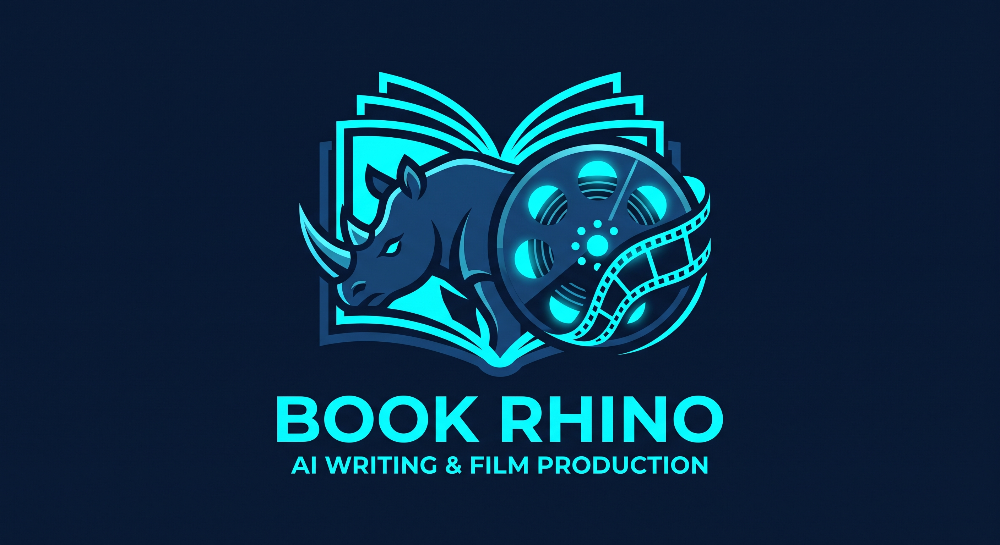

# Book Rhino - AI-Powered Writing & Production Assistant

Book Rhino is a sophisticated Rails application designed to help movie writers, screenwriters, and film producers use AI to ship books and films. It provides a comprehensive suite of tools for managing narratives, characters, and media, enhanced with AI-powered content generation capabilities.

It includes all the tools you need to:
- Organize your ideas
- Generate prompts
- Organize media
- Produce the final output (be it a book or a film)

## Showcase

Check out these completed projects built with Book Rhino:
- **Book**: [Jealousy in the Jungle: An Invitation for Rivals, An Awakening](https://www.amazon.com/Jealousy-Jungle-Invitation-Rivals-Awakening/dp/B0DY872FHM)
- **Movie**: [The Drift](https://www.youtube.com/watch?v=pmE3Yrr0104) | [IMDb Page](https://www.imdb.com/title/tt46763502)

## Features

### Architect Your Masterpiece
Revolutionize your storytelling by building vast, intricate worlds and narratives from the ground up. Book Rhino empowers you to structure your vision using proven narrative frameworks, multiple perspectives, and deeply woven story elements. Effortlessly define writing styles, establish moral alignments, and orchestrate the relationships between every facet of your universe—turning an abstract idea into a cohesive, production-ready blueprint.

### Bring Characters to Life
Unleash limitless creativity when forging the heart of your story. Move beyond simple names and ages to sculpt rich, multi-dimensional characters complete with psychological depths, detailed backstories, and defining archetypes. With AI-assisted development, you can continuously iterate on their profiles, ensuring every protagonist, antagonist, and supporting role feels remarkably authentic and inextricably tied to the world they inhabit.

### AI-Powered Scene Generation
Breathe life into every scene with an intelligent, unyielding generation pipeline. Command the AI to construct vivid scene outlines, immersive location settings, and compelling dialogue while adhering to your strict narrative constraints. By maintaining complete control over the creative boundaries, you ensure that every generated sequence perfectly aligns with your established writing style and plot direction.

### Seamless Production Workflow
Accelerate your journey from concept to final output with a toolset designed for ultimate efficiency. Effortlessly merge, assemble, and version-track your content as it evolves. When you are ready to expand your workflow, the streamlined prompt generation engine allows you to instantly export hyper-targeted context to external AI models with a single click—ensuring your production never misses a beat.

## Documentation

- **[Setup Guide](docs/SETUP.md)**: Installation and content import instructions.
- **[Development Guide](docs/DEVELOPMENT.md)**: Contribution instructions and an overview of our technical stack.

## License

MIT License

Copyright (c) 2026 Book Rhino

Permission is hereby granted, free of charge, to any person obtaining a copy
of this software and associated documentation files (the "Software"), to deal
in the Software without restriction, including without limitation the rights
to use, copy, modify, merge, publish, distribute, sublicense, and/or sell
copies of the Software, and to permit persons to whom the Software is
furnished to do so, subject to the following conditions:

The above copyright notice and this permission notice shall be included in all
copies or substantial portions of the Software.

THE SOFTWARE IS PROVIDED "AS IS", WITHOUT WARRANTY OF ANY KIND, EXPRESS OR
IMPLIED, INCLUDING BUT NOT LIMITED TO THE WARRANTIES OF MERCHANTABILITY,
FITNESS FOR A PARTICULAR PURPOSE AND NONINFRINGEMENT. IN NO EVENT SHALL THE
AUTHORS OR COPYRIGHT HOLDERS BE LIABLE FOR ANY CLAIM, DAMAGES OR OTHER
LIABILITY, WHETHER IN AN ACTION OF CONTRACT, TORT OR OTHERWISE, ARISING FROM,
OUT OF OR IN CONNECTION WITH THE SOFTWARE OR THE USE OR OTHER DEALINGS IN THE
SOFTWARE.
