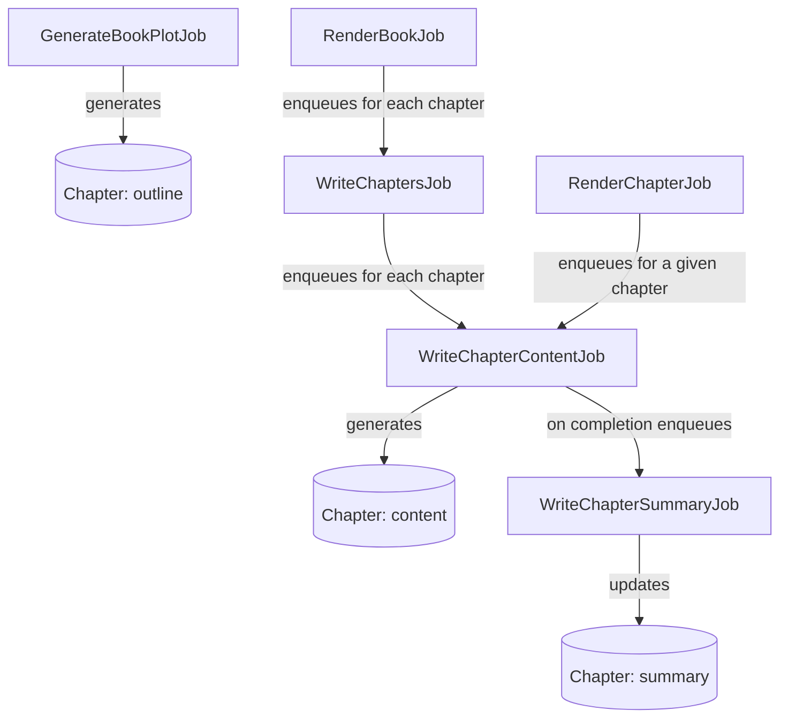

# Chapter Generation Flow

This diagram illustrates the sequence of jobs involved in generating a chapter's content, outline, and summary.
See also the [Scene Generation Flow](scene_generation_flow.md) for how scenes within a chapter are generated.

