# Entity Relationship Diagram

This diagram maps out the relationships between the various models in the application based on their Active Record associations. It includes entities, their attributes (columns and data types), and explicitly maps out join entities for many-to-many relationships.

```mermaid
erDiagram
    %% Core Entities
    Book {
        bigint id PK
        text title
        bigint writing_style_id FK
        datetime created_at
        datetime updated_at
        bigint perspective_id FK
        text moral
        text plot
        integer chapter_count
        integer pages
        bigint narrative_structure_id FK
        bigint protagonist_id FK
        boolean pending
        boolean rendering
    }
    Chapter {
        bigint id PK
        integer number
        text summary
        text content
        bigint book_id FK
        datetime created_at
        datetime updated_at
        string name
        text outline
        boolean rendering
    }
    Character {
        bigint id PK
        string name
        string gender
        bigint age
        string ethnicity
        string nationality
        text appearance
        text health
        text fears
        text desires
        text backstory
        text skills
        text values
        datetime created_at
        datetime updated_at
        text prompt
        boolean pending
    }
    Location {
        bigint id PK
        string name
        text lighting
        text time
        text noise_level
        text comfort
        text aesthetics
        text accessibility
        text personalization
        datetime created_at
        datetime updated_at
        bigint region_id FK
        text description
        text prompt
        boolean pending
    }
    Region {
        bigint id PK
        string name
        string city
        string country
        text description
        datetime created_at
        datetime updated_at
        string state
    }
    WritingStyle {
        bigint id PK
        string name
        datetime created_at
        datetime updated_at
        text prompt
        boolean pending
    }
    Text {
        bigint id PK
        text corpus
        bigint writing_style_id FK
        datetime created_at
        datetime updated_at
        string name
    }
    Perspective {
        bigint id PK
        string name
        text narrator
        text pronouns
        text effect
        text example
        datetime created_at
        datetime updated_at
    }
    NarrativeStructure {
        bigint id PK
        string name
        text description
        text parts
        datetime created_at
        datetime updated_at
    }
    CharacterImage {
        bigint id PK
        bigint character_id FK
        string title
        datetime created_at
        datetime updated_at
    }
    LocationImage {
        bigint id PK
        bigint location_id FK
        string title
        datetime created_at
        datetime updated_at
    }
    CharacterType {
        bigint id PK
        string name
        text definition
        text purpose
        text example
        datetime created_at
        datetime updated_at
    }
    MoralAlignment {
        bigint id PK
        string name
        text description
        text examples
        datetime created_at
        datetime updated_at
    }
    PersonalityTrait {
        bigint id PK
        string name
        text description
        datetime created_at
        datetime updated_at
    }
    Archetype {
        bigint id PK
        string name
        text traits
        text examples
        datetime created_at
        datetime updated_at
    }

    %% Join Entities (for has_and_belongs_to_many & specific joins)
    BookAntagonist {
        bigint id PK
        bigint book_id FK
        bigint character_id FK
        datetime created_at
        datetime updated_at
    }
    BooksCharacters {
        bigint book_id FK
        bigint character_id FK
    }
    BooksLocations {
        bigint book_id FK
        bigint location_id FK
    }
    CharactersLocations {
        bigint id PK
        bigint character_id FK
        bigint location_id FK
        datetime created_at
        datetime updated_at
    }
    CharacterTypesCharacters {
        bigint character_id FK
        bigint character_type_id FK
    }
    CharactersMoralAlignments {
        bigint character_id FK
        bigint moral_alignment_id FK
    }
    CharactersPersonalityTraits {
        bigint character_id FK
        bigint personality_trait_id FK
    }
    ArchetypesCharacters {
        bigint character_id FK
        bigint archetype_id FK
    }

    %% 1-to-Many Relationships
    Book ||--o{ Chapter : "has_many"
    WritingStyle ||--o{ Book : "has_many"
    WritingStyle ||--o{ Text : "has_many"
    Perspective ||--o{ Book : "has_many"
    NarrativeStructure ||--o{ Book : "has_many"
    Character ||--o{ Book : "protagonist_books"
    Region ||--o{ Location : "has_many"
    Location ||--o{ LocationImage : "has_many"
    Character ||--o{ CharacterImage : "has_many"

    %% Many-to-Many Relationships (via Join Entities)
    Book ||--o{ BookAntagonist : "has_many"
    Character ||--o{ BookAntagonist : "has_many"
    
    Book ||--o{ BooksCharacters : "has_many"
    Character ||--o{ BooksCharacters : "has_many"
    
    Book ||--o{ BooksLocations : "has_many"
    Location ||--o{ BooksLocations : "has_many"
    
    Character ||--o{ CharactersLocations : "has_many"
    Location ||--o{ CharactersLocations : "has_many"
    
    Character ||--o{ CharacterTypesCharacters : "has_many"
    CharacterType ||--o{ CharacterTypesCharacters : "has_many"
    
    Character ||--o{ CharactersMoralAlignments : "has_many"
    MoralAlignment ||--o{ CharactersMoralAlignments : "has_many"
    
    Character ||--o{ CharactersPersonalityTraits : "has_many"
    PersonalityTrait ||--o{ CharactersPersonalityTraits : "has_many"
    
    Character ||--o{ ArchetypesCharacters : "has_many"
    Archetype ||--o{ ArchetypesCharacters : "has_many"
```

