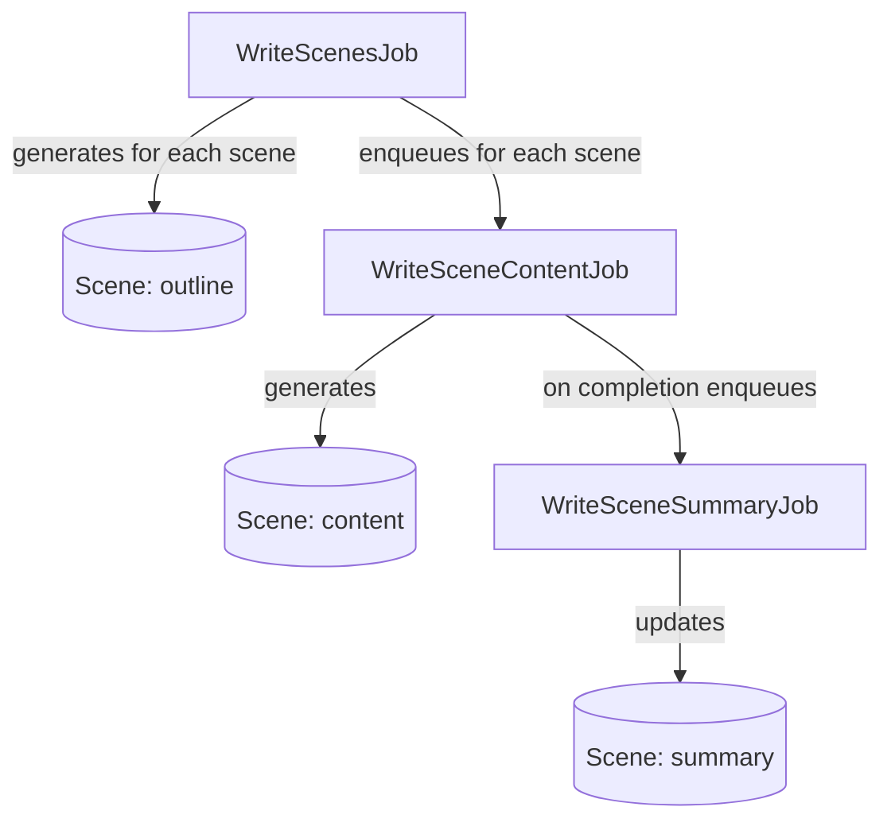

# Scene Generation Flow

This diagram illustrates the sequence of jobs involved in generating a scene's content, outline, and summary.
See also the [Chapter Generation Flow](chapter_generation_flow.md) for how chapters are generated.

